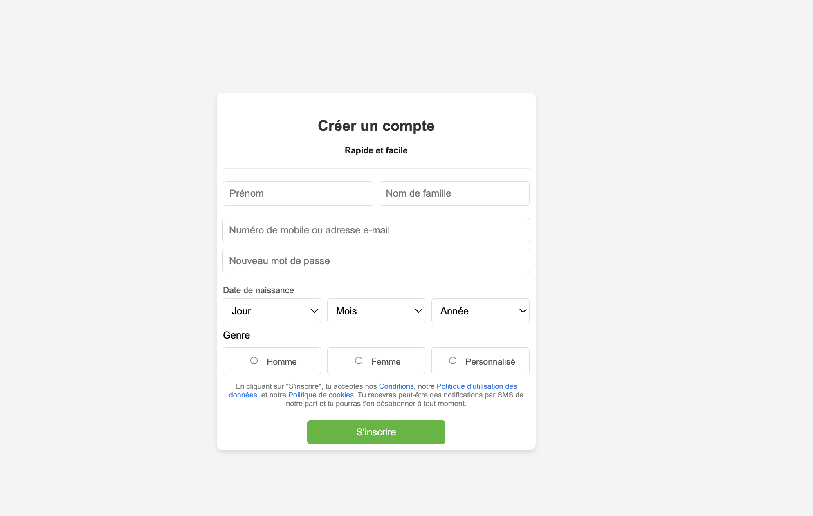

## Projet_4: Facebook_SignUP_Page
Projet Formulaire d'Inscription Facebook
### Objectif
Créer un formulaire d'inscription fonctionnel et esthétique pour une page de création de compte Facebook en utilisant uniquement HTML et CSS. Ce projet met en pratique des concepts de mise en page, de gestion des formulaires et de style visuel.

## Spécifications
Formulaire d'inscription : Le formulaire comprend des champs pour le prénom, le nom de famille, l'adresse e-mail ou le numéro de téléphone, le mot de passe, la date de naissance, et le genre.

* Champ Date de Naissance : Trois menus déroulants pour sélectionner le jour, le mois, et l'année de naissance.

* Genre : Trois options radio (Homme, Femme, Personnalisé) avec un affichage horizontal.

* Validation : Des champs obligatoires pour s'assurer que l'utilisateur complète toutes les informations avant de soumettre le formulaire.

## Technologies

HTML5 : Structure du contenu et des éléments de formulaire.

CSS3 : Stylisation de la page pour une présentation professionnelle et réactive.

## Expérience
Ce projet m'a permis de développer mes compétences en mise en page responsive, et en validation des champs avec HTML et CSS. Les défis rencontrés incluaient l'alignement des éléments de manière fluide et l'ajustement de l'interface pour assurer une expérience utilisateur optimale.

## Fonctionnalités
 - Affichage réactif : Le formulaire s'ajuste automatiquement en fonction de la taille de l'écran, ce qui le rend adapté à différents appareils.

 - Design cohérent : Choix de couleurs et mise en forme des champs pour une lecture et une interaction facile.

## Résultats
Le formulaire a été conçu avec une interface intuitive, permettant à l'utilisateur de remplir rapidement ses informations. Les boutons radio sont alignés correctement, le champ de date de naissance est pratique, et le formulaire est esthétique et professionnel.

## Capture d'ecran:

## Lien vers le projet :
[lien github_page](https://asmah003.github.io/Facebook_Home_Page/)

